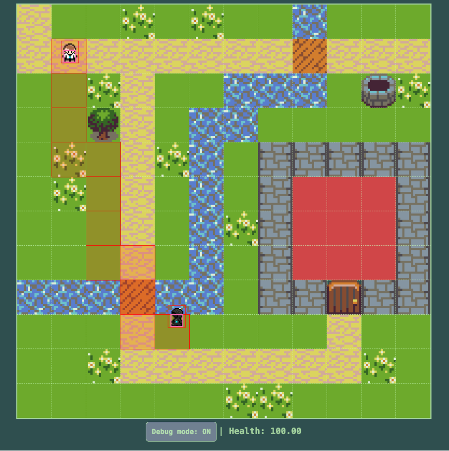

# Datastrukturer og Algoritmer - sat i spil
### Eksamensprojekt – A* Pathfinding i et interaktivt 2D spil.

**Gruppemedlemmer:**

Emil Vennervald Nielsen & Chris Skov Sørensen

**Links:**

GitHub Repository: https://github.com/ce-kea/movement-collision

Deployment: https://ce-kea.github.io/movement-collision/